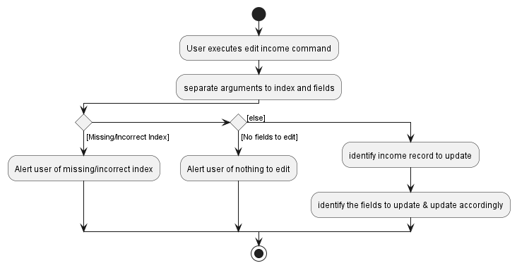
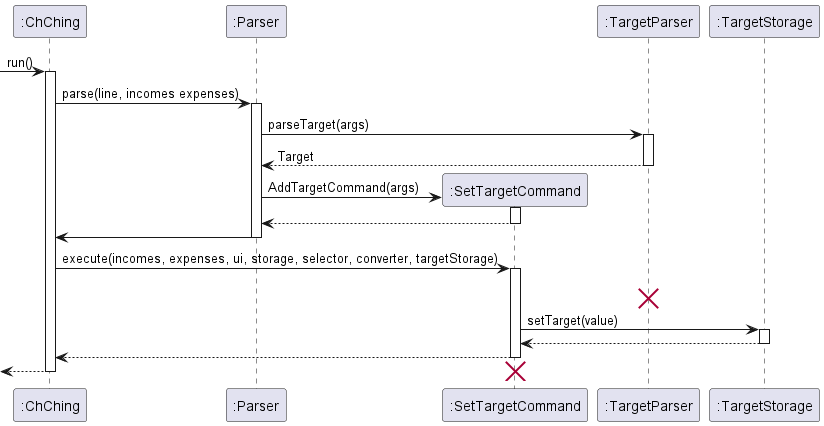

# Developer Guide

## Acknowledgements

{list here sources of all reused/adapted ideas, code, documentation, and third-party libraries -- include links to the original source as well}

## Design & implementation

{Describe the design and implementation of the product. Use UML diagrams and short code snippets where applicable.}

## Implementation

### Record and RecordList  

The main class in our program is the ```Record``` and ```RecordList``` abstract classes, in which ```Income```, ```Expense``` will inherit from ```Record``` and ```IncomeList``` and ```ExpenseList``` will inherit from ```RecordList```. Most commands will act on instances of the ```Income```, ```Expense```,```IncomeList``` and ```ExpenseList``` classes.  


### DeleteIncomeCommand 

The proposed DeleteIncomeCommand mechanism is facilitated by ```System```, ```Incomes```, ```UI``` and ```ChChingException```.  
The command receives the instruction from ```UI``` and will call the ```execute``` method.  
If ```index <= 0```, the command will throw a new ChChingException and print ```"Zero/Negative index"```.  
If ```index > incomes.size()```, the command will also throw a new ChChingException and print ```"The number is too big"```  
Entering any of these optional lines will result in early termination of the command.  
Or else, the command will continue to delete the entry at the particular index.  
Afterwards, the ```execute()``` method will print ```"Income deleted, here is the updated list:"``` and prints the entries in the income list.


### Target and TargetStorage

The `Target` and `TargetStorage` class allows users to set a target for their ideal balance.


### [Proposed] EditIncomeCommand/EditExpenseCommand
The proposed edit income command is facilitated by `Parser`, `EditIncomeCommand`, `IncomeList`, while the proposed edit expense command is facilitated by `Parser`, `EditExpenseCommand` and `ExpenseList`. 

Note that below highlights the implementation of the edit income command, with edit expense command following the same implementation.

Given below is how the edit income mechanism works at each step:
1. The user types in the command for edit income with the necessary arguments given to indicate which income record to edit and what fields to edit for the chosen income record.
2. The line inputted by the user will then be parsed by `Parser`, where it will check if the input contains a valid index with valid fields to edit. If they are valid, it will return `EditIncomeCommand`. Else it will throw a `ChChingException` indicating an error in the input from the user.
3. `EditIncomeCommand` will then perform its `execute` method, where for each field to be edited, it will call `editIncome` method from the `ExpenseList` class. This would then update the required income record accordingly.

The following sequence diagram shows how the edit income command works:
<br> 

The edit expense command works in a similar way, with its sequence diagram as shown:
<br> 

The following activity diagram summarises what happens when a user executes edit income command:
<br> 
<br> Note that edit expense command produces the same activity diagram.

**Design Considerations**
<br>The following are the design alternatives we considered for edit income/expense command:

* **Alternative 1 (current choice):** Edit only the specific fields indicated in the input arguments.
    * Pros: Easier for the user to input an edit.
    * Cons: May introduce more bugs.
* **Alternative 2:** Edit to require user to rewrite all its fields.
    * Pros: Easier to implement.
    * Cons: Not any easier than having the user to just delete and add new expense/income.

### ListExpenseCommand
The listExpenseCommand is facilitated by ```Parser```, ```ListExpenseCommand``` and ```ExpenseList```.

1. The user inputs the command top list expense. This input is handled by```Parser``` which returns the
   ```listExpenseCommand``` if successful.
2. ```ListExpenseCommand``` will then call its ```execute``` method
   which makes use of ```System``` to print a new line ```"Expenses:"```.
3. The ```expenseList``` method ```printExpenseList```
   is called, which iterates through the expenseList, ```expenses``` and prints the index as well as a completed string of
   expenses in ```expenses```.


### SetTargetCommand
The setTargetCommand is facilitated by ```ChChing```, ```Parser```, ```TargetParser```, ```TargetStorage```.
When the command receives to set target, the ```parse()``` method of the ```Parser``` object will read in the command and call the ```parseTarget()``` method from the TargetParser class 
to instantiate a Target object and initializes a target value. Afterwards, ```parse()``` method calls the ```AddTargetCommand``` and  instantiate a ```SetTargetCommand``` object and returns to the ```Parser``` object.
The ```Parser``` object then returns to ```ChChing```. ```ChChing``` object then runs the ```execute()``` method of the SetTargetCommand object. The method then calls the ```setTarget()``` method of the ```TargetStorage``` object to store the previously initialized ```Target``` object.


### SetCurrencyCommand
The setCurrencyCommand is facilitated by ```System```, ```Selector```,  ```UI``` and ```ExpenseList```.
The command receives the instruction from ```UI``` and will call the ```execute``` method.
The ```execute()``` method in setCurrencyCommand will then call the ```containsCurrency(currency)``` method from ```Selector```.
If the method returns false, which indicates that the currency is not available, the command will throw a new ChChingException and print ```"Currency not available"```.
If the method returns true, the command will continue to set the currency in the selector hashmap to true.
Afterwards, the ```execute()``` method will call the ```printSelector()``` method from ```Selector```.
The ```printSelector()``` method will print all the available currencies in the selector hashmap.
The selected currencies will be marked with a ```[X]``` and the unselected currencies will be marked with a ```[ ]```.


## Product scope

### Target user profile

Target users are people who are keen on improving their financial accountability

### Value proposition

The value proposition of ChChing is its ability to track income and expenses on a daily basis.

## User Stories

| Version | As a ...  | I want to ...                           | So that I can ...                                                                       |
|---------|-----------|-----------------------------------------|-----------------------------------------------------------------------------------------|
| v1.0    | new user  | see usage instructions                  | refer to them when I forget how to use the application                                  |
| v1.0    | user      | add new expense to the records          | record all my expenses                                                                  |
| v1.0    | user      | add new income to the records           | record all my incomes                                                                   |
| v1.0    | user      | view all the records                    | refer to them when I forgot my expenses and incomes                                     |
| v1.0    | user      | edit the records                        | modify/fix if the records is changed/wrong                                              |
| v1.0    | user      | know current balance                    | aware how much money do I have left                                                     |
| v2.0    | user      | edit my existing entries                | rectify or update any entries without having to enter another entry and delete an entry |
| v2.0    | user      | find specific entries                   | refer to specific entries when necessary                                                |
| v2.0    | foreigner | view my entries in a different currency | read my incomes and expenses in a currency I am familiar with                           |
| v2.0    | user      | set a target for my balance             | improve my financial management                                                         |
| v2.0    | user      | see the target i have set               | remind myself of my target                                                              |
| v2.0    | user      | reset my income/expense lists or both   | have a fresh list                                                                       |
## Non-Functional Requirements

{Give non-functional requirements}

## Glossary

* *glossary item* - Definition

## Instructions for manual testing

{Give instructions on how to do a manual product testing e.g., how to load sample data to be used for testing}
